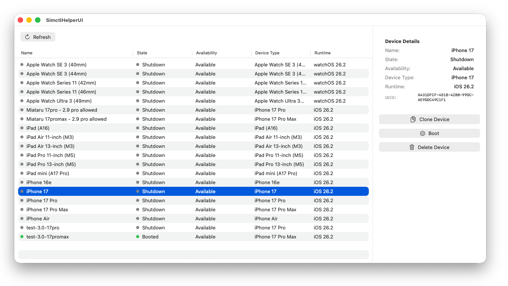

# SimctlHelperUI

A macOS SwiftUI application that provides a graphical user interface for managing iOS simulators. SimctlHelperUI wraps the `xcrun simctl` command-line tool, making it easier to view, clone, delete, and control iOS simulators through an intuitive interface.



## Features

- **Device List View**: Browse all available iOS simulators in a sortable table
- **Device Management**:
  - Clone simulators with custom names
  - Delete simulators
  - Delete all unavailable simulators in one action (`simctl delete unavailable`)
  - Boot and shutdown simulators
- **Device Information**: View detailed information including:
  - Device name and UDID
  - Current state (Booted/Shutdown)
  - Availability status
  - Device type (e.g., iPhone 17 Pro)
  - Runtime version (e.g., iOS 26.2)
- **Visual Indicators**: Color-coded status indicators for quick device state recognition
- **Sortable Columns**: Sort devices by name, state, availability, device type, or runtime version
- **Auto-refresh**: Automatically refreshes the device list after operations

## Requirements

- macOS (tested on macOS 14+)
- Xcode with Command Line Tools installed
- iOS Simulator runtime installed

## Installation

1. Clone the repository:
   ```bash
   git clone https://github.com/yourusername/SimctlHelperUI.git
   cd SimctlHelperUI
   ```

2. Open the project in Xcode:
   ```bash
   open SimctlHelperUI.xcodeproj
   ```

3. Build and run the project (⌘R) or create an archive for distribution.

## Usage

1. Launch SimctlHelperUI
2. The app will automatically load all available iOS simulators
3. Select a device from the list to view its details and perform actions
4. Use the action panel on the right to:
   - **Clone Device**: Create a copy of the selected device with a new name
   - **Boot/Shutdown**: Start or stop the selected simulator
   - **Delete Device**: Remove the simulator (with confirmation)
5. If unavailable simulators exist, use **Delete Unavailable** in the top toolbar to remove all unavailable entries at once (with confirmation).

### Refreshing the Device List

Click the "Refresh" button in the toolbar or select a different device to automatically refresh the list.

## Architecture

The app follows the Model-View-ViewModel (MVVM) architecture:

- **Models** (`SimctlModels.swift`): Data structures for simulators, runtimes, and device types
- **Services** (`SimctlService.swift`): Executes `xcrun simctl` commands and handles JSON parsing
- **ViewModels** (`DeviceListViewModel.swift`): Manages application state, sorting, and device operations
- **Views**: SwiftUI interface components for displaying and interacting with devices

## Technical Details

- Built with SwiftUI for macOS
- Uses `Process` API to execute `xcrun simctl` commands
- Asynchronous command execution with proper error handling
- Thread-safe data collection for command output
- JSON parsing using `Codable` protocols

## License

This project is licensed under the BSD-2-Clause License - see the [LICENSE.md](LICENSE.md) file for details.

## Author

Daniel Kirstenpfad - [https://schrankmonster.de](https://schrankmonster.de)

## Contributing

Contributions are welcome! Please feel free to submit a Pull Request.

## Acknowledgments

- Built using Apple's `xcrun simctl` command-line tool
- Uses SwiftUI for the user interface
