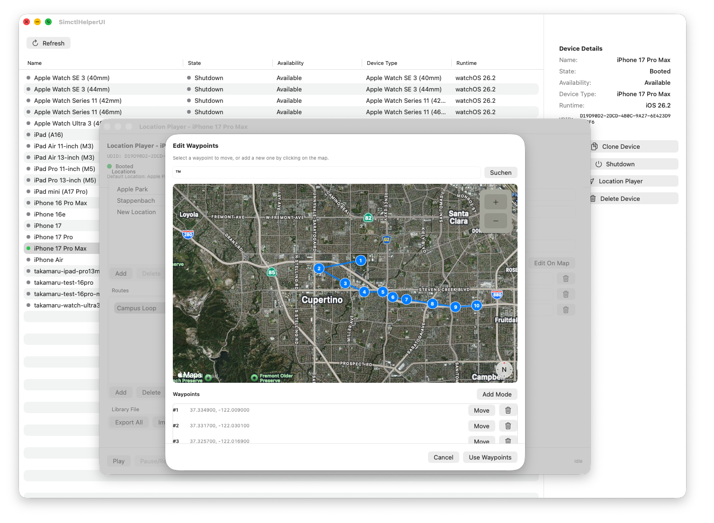

# SimctlHelperUI


A macOS SwiftUI application that provides a graphical interface for `xcrun simctl`.
It helps manage iOS simulators and includes dedicated per-device location simulation windows for static locations and route playback.



## Feature Overview

- Native macOS device overview:
  - Window toolbar with `Open Controls`, `Refresh`, filter segments, search, and view options
  - Searchable, sortable device table (name, state, availability, device type, runtime)
  - Inspector for the selected simulator instead of a duplicated action panel
  - Row context menu for `Open Controls`, `Boot`/`Shutdown`, `Clone`, `Delete`, `Copy UDID`
- Simulator management:
  - Boot / Shutdown
  - Clone
  - Delete
  - Delete unavailable devices from a confirmation flow in view options
- Location Simulation windows:
  - One dedicated window per simulator UDID
  - Open from row context menu (`Open Controls`)
  - Open by double-clicking a booted device row
  - Open from the inspector action button
- Per-device route playback control using `xcrun simctl location`:
  - Play / Pause / Resume / Stop
  - Reset to configured default location
  - Isolated sessions per simulator UDID
- Location and route library management:
  - Saved locations and saved routes
  - Inline rename/editing in the detail panel
  - GPX route import
  - Library export/import as JSON
  - Selective import (choose which locations/routes to import)
  - Typed in-app feedback (`info`, `success`, `warning`, `error`)
- Diagnostics:
  - Separate Diagnostics window for route and command logs
  - Copy, clear, refresh, and export diagnostics without cluttering the primary workflow

## Location Simulation

Each `Location Simulation` window opens in its own macOS window and is permanently bound to a single simulator UDID.

### Window & Refresh Behavior

- The app opens a dedicated main window (`Device Overview`) on launch.
- The main window and the per-device control windows share a single `DeviceStore`, so simulator status stays consistent across windows.
- The `Device Overview` window is no longer forced to the foreground when assigning/opening `Location Simulation` windows.
- Opening/focusing a `Location Simulation` window no longer restores focus back to the previously active window.
- The `Device Overview` device list refreshes automatically in the background every 10 seconds (non-blocking UI refresh).
- Each `Location Simulation` window provides its own `Refresh` toolbar action for a one-time device status refresh.
- Closing a window with an active route asks whether playback should continue in the background, stop before closing, or cancel the close action.
- Standard macOS window chrome is enforced so the content and split separators start below the toolbar/titlebar instead of running underneath it.

### Location Features

- Library actions are split by scope:
  - `+` in the `Locations` section header adds a new saved location
  - Right-click a saved location for selection-oriented shortcuts
- Apply a static location with `simctl location <udid> set <lat>,<lon>`
- Rename and edit saved locations inline in the detail panel
- Edit coordinates manually
- Edit location on map

### Route Features

- Library actions are split by scope:
  - `+` in the `Routes` section header adds a new route
  - Right-click a saved route for selection-oriented shortcuts
- Waypoint-based routes using `simctl location <udid> start ...`
- Rename saved routes inline in the detail panel
- Route parameters:
  - Speed (`--speed`)
  - Update mode interval (`--interval`) or distance (`--distance`)
- Playback controls:
  - `Play` starts route simulation
  - `Pause/Resume` uses process signals (`SIGSTOP` / `SIGCONT`), including fallback signaling for external `simctl location ... start` processes on long routes
  - `Stop` terminates route process and clears simulated location

### Map Editing

- Click to place points
- Drag-and-drop existing waypoint markers to reposition them
- Numbered waypoint markers
- Add mode toggle with visual state
- Search integrated into the editor workflow to jump to places (`MKLocalSearch`)
- Zoom controls (`+` / `-`)

## Library Import/Export

- The app menu (`File`) provides:
  - `Import GPX Route...`
  - `Import Location/Route Library...`
  - `Export Location/Route Library...`
- These flows are attached to the active app window through focused scene values.
- No neutral placeholder control window is created for import/export anymore.
- In the selection sheet you can:
  - Select all/none for locations
  - Select all/none for routes
  - Import only chosen entries
- Import behavior:
  - Validates entries before import
  - Preserves existing data
  - Resolves ID collisions by generating new UUIDs
  - Surfaces partial imports as warnings instead of generic errors

## Requirements

- macOS 14+
- Xcode with Command Line Tools
- iOS Simulator runtimes installed

## Installation

1. Clone repository:
   ```bash
   git clone https://github.com/yourusername/SimctlHelperUI.git
   cd SimctlHelperUI
   ```
2. Open project:
   ```bash
   open SimctlHelperUI.xcodeproj
   ```
3. Build and run (`Cmd+R`).

## Usage

1. Launch SimctlHelperUI.
2. Search, filter, and sort the simulator list in the main `Device Overview` window.
3. Select a simulator and use the inspector or row context menu for device actions.
4. Open `Location Simulation` for a booted simulator:
   - context menu,
   - double-click on a booted row (table primary action), or
   - inspector button.
5. In `Location Simulation`:
   - manage locations and routes,
   - edit names and parameters inline in the detail panel,
   - import GPX routes,
   - play/pause/resume/stop route playback,
   - export/import the shared JSON library.
6. Open `Window > Diagnostics` when you need command or route logs.

## Architecture

The app follows MVVM.

- Models: simulator and location domain models (`SimctlModels.swift`, `LocationModels.swift`)
- Services:
  - `SimctlService`: command execution and session control for simctl
  - `LocationLibraryStore`: persistence for location/route library
  - `GPXRouteImporter`: GPX parsing into saved routes
- ViewModels:
  - `DeviceStore`
  - `LocationLibraryController`
  - `LocationPlayerViewModel`
- Views:
  - `ContentView` with toolbar, searchable/sortable table, and inspector
  - `LocationPlayerView` (`Location Simulation`) and auxiliary editing/import windows
  - `DiagnosticsWindowView`
- Window coordination:
  - `LocationPlayerWindowCoordinator` manages per-device window identity, minimum sizes, focus, close confirmation hooks, and standard macOS window chrome
- Feedback:
  - `FeedbackMessage` is used across the app for typed transient UI feedback

## Recent Changes (Documented)

- Native macOS UX refresh:
  - Replaced the old duplicated action panel flow with a real toolbar + inspector main window layout.
  - Added live search, filter segments, explicit sorting controls, and richer device context menus.
  - Renamed `Location Player` to `Location Simulation` to match the actual simulator-control scope.
  - Bound each control window to exactly one simulator UDID and removed in-window device switching.
  - Moved diagnostics out of the main workflow into a dedicated Diagnostics window.
  - Replaced untyped string errors with typed `FeedbackMessage` banners for clearer success/warning/error states.
  - Switched library import/export away from neutral fallback windows to focused scene actions.
  - Enforced standard macOS window chrome so split separators and sidebars begin below the toolbar/titlebar.
- UI/UX polish + i18n v1 (DE/EN):
  - Reworked location simulation navigation from mode toggle to persistent sidebar sections (`Locations` + `Routes`) backed by `LibrarySelection`.
  - Migrated large modal workflows (Map Editor, GPX Preview, Library Import Selection) to dedicated resizable auxiliary windows with per-window autosaved frame state.
  - Introduced localization infrastructure (`L10n` + `Localizable.xcstrings`) and migrated visible UI labels, error messages, and generated default names to localized strings.
  - Added German as project localization region and enabled automatic language selection via system locale (`en`/`de`).
  - Refined main window density/spacing and adaptive panel sizing to reduce dead whitespace.
  - Added native minimum-size enforcement for location simulation windows (minimum equals default size) using system window constraints instead of manual resize correction.
  - Added semantic button highlighting for route/location execution controls (`Play/Pause/Resume/Stop`, `Set/Clear/Reset Location`).
  - Cleaned String Catalog metadata to avoid false-positive stale markers when using the `L10n` wrapper pattern.
- Added location simulation access via:
  - booted row context menu,
  - double-click on booted row,
  - inspector button.
- Added robust map workflow for location and waypoint editing.
- Added waypoint drag-and-drop with numbered markers.
- Added map search and zoom controls.
- Added fixed bottom action bar in map editor to keep save/cancel visible.
- Added Add Mode toggle behavior with active highlighting.
- Added GPX route import.
- Added direct rename actions for selected locations and routes in the location simulation library panel.
- Added library JSON export/import with selective import dialog.
- Added ignore rules for Xcode user data (`**/xcuserdata/`, `*.xcuserstate`).
- Fixed long-route playback control so `Pause/Resume` remains usable when `simctl` hands route execution to external processes.
- Changed app startup/main-scene handling to open `Device Overview` as the primary window.
- Removed automatic main-window foreground stealing when location simulation windows are created/updated.
- Reworked main device table open behavior to use table primary action (double-click) instead of per-cell gestures, improving row selection reliability.
- Simplified window focus coordination so main window and location simulation windows do not fight for key focus after opening/focusing control windows.
- Added non-blocking periodic background refresh for the main device list (10-second interval), while keeping manual refresh support.
- Disabled periodic device polling in location simulation (one-time refresh on open; manual refresh via main window).
- Added app-menu import/export commands for location/route data (File menu), wired to the existing import/export flows.
- Added explicit `Quit SimctlHelperUI` menu entry and configured app termination when the last window closes.
- Reworked single-location preview map rendering to update pin placement reliably when switching selected locations.
- Fixed a teardown stability issue in tests/preview lifecycle around `LocationPlayerViewModel` observer updates and test service deallocation.

## License

BSD-2-Clause. See [LICENSE.md](LICENSE.md).
